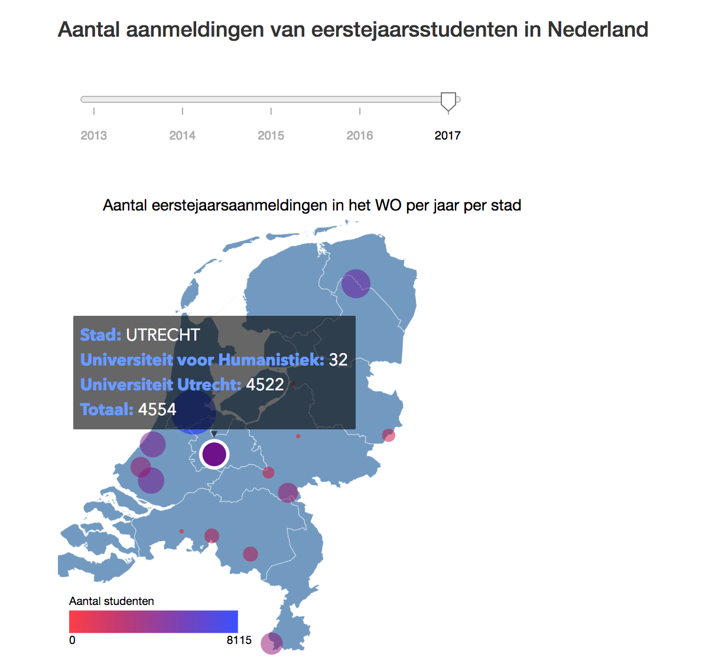

# Aanmeldingen eerstejaarsstudenten WO
Annemijn Dijkhuis
11149272
Minor Programmeren UvA

## Dataprocessing project 
https://annemijnd.github.io/project/

# Introductie

Nederland is een kennisland en het is daarom belangrijk dat er wordt gezorgd dat iedereen die wil kan studeren.
Met de bezuinigingen, verandering in het leenstel en de vele discussies die om het studeren heen plaats vinden,
is het belangrijk feit van fictie kunnen blijven onderschijden en argumenten te kunnen onderbouwen met cijfers. 
Hierom zijn voor dit project deze cijfers in kaart gebracht. 

Daarnaast is het nuttig voor aankomend studenten om te weten hoe hun mogelijke studie er uit ziet. 

In dit project zal met data van DUO de aanmeldingen van eerstejaars bachelorstudenten op het WO worden weergegeven tussen 2013 en 2017. Dit wordt op drie verschillende manieren gedaan. 

## Kaart van Nederland

Door middel van een kaart van Nederland kan worden gezien in welke steden de meeste studenten zich hebben aangemeld per jaar.
Er kan met een slider van jaar worden veranderd. Grotere bolletjes representeren meer studenten. Daarnaast geeft de kleur, zoals deze op de legenda is weergegeven, aan hoeveel studenten zih hebben aangemeld. De kaart is verbonden aan de lijngrafiek en aan de staafdiagram door op een stad te klikken. 

        

## Lijngrafiek

De lijngrafiek geeft voor een instelling en een opleiding (of alle opleidingen) weer hoeveel studenten zich hebben aangemeld tussen 2013 en 2017. Er kunnen vier lijnen worden toegevoegd door gebruik te maken van het dropdown menu, of door te klikken op een stad uit de kaart. Er kunnen lijnen worden verwijderd door op het gelkeurde blokje in de legenda te klikken. Er kunnen maximaal vier lijnen in de grafiek staan.

## Gegroepeerde staafdiagram

Het gegroepeerde staafdiagram bestaat uit staven die mannen, vrouwen  en de totaalhoeveelheid studenten weergeven voor één jaar. Dit kan voor een instelling en opleiding zijn, maar ook voor een instelling en alle opleidingen. Wanneer er op een stad of een datapunt uit de lijngrafiek wordt geklikt, komt er een gegroepeerd staafdiagram bij door middel van een updatefunctie.

