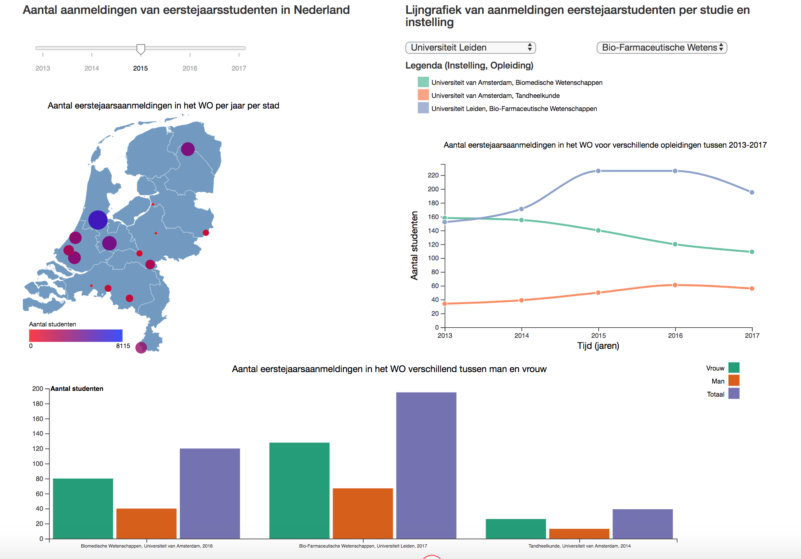

# Eindproject minor programmeren
### Annemijn Dijkhuis - 11149272

#### LET OP - Ik heb het design document per ongeluk aangepast omdat ik dacht dat het de bedoeling was deze te updaten. Voor de goede versie, zie de oudere versie.

## Veranderingen in studeren

In verschillende debatten rondom studeren, denk hierbij aan de man/vrouw verhoudingen, maar ook aan de veranderingen van het studeren sinds de afschaffing van de studiefinanciering als gift, is data van aanmeldingen voor studies essentieel. Een visualisatie hiervan kan een gesprek bevorderen en aannames ondersteunen. Daarnaast kan het voor aankomend studenten wellicht prettig zijn om van een studie waarin zij geinteresseerd zijn te kunnen opzoeken hoeveel studenten er (over de agelopen jaren) zich hebben aangemeld.

Voor dit project zijn met behulp van data van DUO verschillende visualisaties gemaakt om deze informatie te weergeven.

## Overzicht pagina

#### Kaart van Nederland
Op deze kaart van Nederland zijn cirkels te zien die verschillende studentensteden representeren. De grootte en kleuren van de cirkels geven aan hoeveel studenten zich in deze stad in het geselecteerde jaar hebben aangemeld. Een jaar kan worden geselecteerd door gebruik te maken van de slider. Wanneer op één van deze cirkels wordt geklikt, wordt een lijngrafiek en een gegroepeerd staafdiagram gemaakt van de instellingen in deze stad.

#### Lijngrafiek
De lijngrafiek geeft weer hoeveel studenten zich hebben aangemeld van 2013 tot en met 2017. Een lijn kan door de gebruiker worden toegevoegd door gebruik van de dropdowns of door te klikken op één van de steden in de kaart van Nederland. Een lijn kan worden verwijderd door te klikken op een legendablok.

#### Gegroepeerd staafdiagram
In deze visualisatie worden gegroepeerde staadiagrammen (GS) getoond, waarbij constant de waardes "Man", "Vrouw" en "Totaal" te zien zijn voor de geselecteerde instelling, opleiding en periode. Een GS kan worden toegevoegd door een stad aan te klikken in de kaart of of door een datapunt aan te klikken in de lijngrafiek. Een GS kan worden verwijderd door op één van de staven te klikken.

## Functionaliteit Code

#### Python

##### convertCSV2JSON.py
In deze functie wordt de CSV file met data omgezet naar een bruikbare JSON. Verder wordt hier data geparsed. Masters en deeltijdstudies worden verwijderd. Sommige studies staan er twee keer in, één keer als "bachelor" en één keer als "propedeuse bachelor". De data van deze datasets worden samengevoegd.

Verder stond voor alle bachelors een "B", zoals bijvoorbeeld: "B Biomedische wetenschappen". Deze "B" wordt in dit script verwijderd.

Er worden twee JSONs gecreeërd:
* JSON met alle data
* JSON met de data voor alle steden (voor de kaart van Nederland)

#### Javascript

##### main.js
In main.js worden de datasets ingeladen en worden de verschillende functies die de visualisaties opzetten aangeroepen:
* createMap()
* lineGraph()
* barGraph()

De datasets worden in globale variabelen gezet, zodat deze makkelijk beschikbaar zijn vanaf de andere functies. Daarnaast zijn een aantal harde variabelen (zoals het eerste en laatste jaar waarin we data bekijken) in globale variabelen gezet.

##### map.js
* createMap
* updateMap
* circleScaleX
* circleScaleY

In map.js wordt een kaart van Nederland gemaakt met behulp van D3 en de eerder ingeladen geodata. Er wordt een lineair scaled legenda gemaakt en een slider waarbij de gebruiker kan kiezen tussen de jaren van 2013-2017.

Verder is er een updatefunctie die aan de hand van een jaartal de cirkels op de kaart plaatst op de positie van een stad. De updatefunctie wordt aangeroepen in createMap met een default waarde van 2017.
De geodata voor de posities van de steden is handmatig verzameld en als JSON geladen. Dit is gebeurd in main.js.

De cirkels zijn verbonden aan de hoeveelheid studenten die zich in dat jaar in die stad hebben aangemeld. Wanneer de slider wordt gebruikt, wordt de updatefunctie aangeroepen. De kleur en grootte van een cirkel worden bepaald aan de hand van een schaal, waarbij een grotere, blauwere cirkel meer studenten betekent dan een kleinere, rode cirkel. Wanneer wordt geklikt op een cirkel, worden de updateLine en updateBarGraph functies aangeroepen.

Om de cirkels op de juiste positie te zetten op de kaart wordt gebruikt gemaakt van een circleScaleX en circleScaleY functie. Deze functie is ontstaan uit het makeScaleFuncties.js script.

##### makeScaleFunctions.js
* test

Deze functie is een functie waarmee met verschillende data uit de geodata van de steden is getest welke schaal de meest accurate plaatsing van de cirkels geeft.

In eerste instantie zijn de posities van twee steden op de kaart-SVG gekozen. Vervolgens is gekeken naar de x en y coordinaten die voor die steden te vinden zijn in de geodata. Hiermee is een functie gemaakt om te voorspellen wat de positie van de andere steden zou zijn, welke vervolgens werd getest in de map.js updatefunctie. Het bleek dat uiteindelijk de meest accurate plaatsing werd verkegen door Groningen en Amsterdam als uitgangspunten te nemen.

De functie speelt geen actieve rol tijdens het gebruik van de pagina.

##### dropdowns.js
* makeDropdowns

In dit stuk script wordt een functie aangeroepen die dropdowns maakt voor de lijngrafiek. De dropdown voor instellingen wordt altijd helemaal gevuld met alle instellingen. De dropdown voor opleidingen wordt enkel gevuld met de opleidingen van de eerder aangeklikte instelling.

##### barGraph.js
* barGraph
* updateBarGraph

In barGraph wordt de basis gelegd voor het kunnen neerzetten van een staafdiagram. Er worden assen, titels en een legenda aangemaakt. De updatefunctie wordt aangeroepen voor een default staafdiagram voor de studie Biomedische wetenschappen aan de UvA in 2016.

In updateBarGraph worden gegroepeerde staafdiagrammen toegevoegd of verwijderd. De data van iedere staafdiagramgroep wordt opgeslagen in BARGRAPHDATA. Als het type "Append" is meegegeven, wordt er één toegevoegd. Als het type "Delete" is, wordt deze verwijderd. Wanneer de gebruiker teveel diagrammen wil plaatsen (meer dan vier), wordt een alertbox opgeroepen. Ook wordt het aangegeven als de gebruiker data wil weergeven waarvan het totaal aantal studenten "0" is. Wanneer op een staaf van een staafdiagram wordt geklikt, wordt de updateBarGraph functie opnieuw aangeroepen met het type "Delete".

De assen worden opnieuw geschaald en de groepen staafdiagrammen die er al staan worden aangepast aan de hand van het enter/update/exit systeem.

##### lineGraph.js
* lineGraph
* updateLine

In lineGraph wordt de basis gelegd voor een lijngrafiek. makeDropdowns wordt aangeroepen en er worden assen, titels en een locatie voor een legenda aangemaakt. De update functie wordt aangeroepen voor een default lijn voor Biomedische wetenschappen aan de UvA.

In updateLine worden lijnen en cirkels, die de class "dot" krijgen toegewezen, toegevoegd of verwijderd. De data van iedere lijn wordt opgeslagen in LINEGRAPHDATA. Als het type "Append" is meegegeven, wordt er één toegevoegd. Als het type "Delete" is, wordt deze verwijderd. Wanneer de gebruiker teveel lijnen wil plaatsen (meer dan vier), wordt een alertbox opgeroepen. Wanneer op een ".dot" wordt gelkikt, wordt updateBarGraph aangeroepen.

Er wordt  een uniek id aangemaakt voor iedere lijn die wordt toegevoegd aan LINEGRAPHDATA. Dit is zodat de legenda goed kan worden geupdate.

Om lijnen en .dots toe te voegen of te verwijderen wordt gewerkt met de enter/update/exit methode.

Als laatste wordt de legenda geupdate naar de aanwezige lijnen. Wanneer op een legendablok wordt geklikt, wordt de bijbehorende lijn verwijderd.

#### HTML

##### index.html
Deze html pagina laat een korte introductie zien van de pagina. Er wordt gebruikt gemaakt van bootstrap. Als laatste wordt index.css aangeroepen.

##### vis.html
Op deze pagina worden de visualisaties getoond. Hier worden ook alle Javascript
bestanden ingeladen. Er wordt gebruik gemaakt van bootstrap en D3. Verder wordt index.css aangeroepen. Er zijn divs gemaakt voor de visualisaties en voor de errorbalk om een duidelijke basis te creeëren voor de site.

##### bronnen.html
Op deze pagina worden de gebruikte bronnen getoond. Er wordt gebruik gemaakt van bootstrap en index.css wordt aangeroepen voor styling.

#### CSS

##### index.css
Deze stylesheet is algemeen voor alle pagina's die worden gemaakt.

## Veranderingen
Er is geen gebruik meer gemaakt van de API met beoordelingen van studies. De beoordelingen bleken enkel voor het jaar 2017.

#### Kaart van Nederland
In eerste instantie was mijn idee een heatmap te maken van Nederland en de hoeveelheid studenten per provincie van elkaar te onderscheiden. Dit leek mij echter toch niet nuttig, omdat dit geen toegevoegde waarde heeft. Ik heb toen gekozen voor de cirkels met verschillende groottes en kleuren per stad. Hiervoor moest ik wel een extra dataset gebruiken.
Ook heb ik besloten de kaart interactief te maken met het staafdiagram en de lijngrafiek.

#### Staafdiagram
In eerste instantie was mijn idee losse staafdiagrammen te maken voor iedere keer dat de gebruiker data selecteerde. Ik heb dit veranderd naar gegroepeerde staafdiagrammen, die elke keer worden toegevoegd aan een bestaand staafdiagram. Dit heb ik gedaan omdat het lastig is verschillende staafdiagrammen, die ieder veschillende assen hebben, met elkaar te vergelijken. Op de huidige manier kan er een betere vergelijking worden gemaakt, omdat er maar één y-as is. Verder heb ik besloten dat de gebruiker maximaal 4 groepen in het diagram mag hebben staan, om overzicht te bewaren.

#### Lijngrafiek
De lijngrafiek interactief is gemaakt met het staafdiagram. Daarnaast is het mogelijk verschillende lijnen toe te voegen. Op deze manier kunnen verschillende studies beter worden vergeleken.

## Uitdagingen
Bij de kaart lag de uitdaging bij het positioneren van de cirkels. Er was hiervan geen voorbeeld te vinden op het internet. Het was daardoor lastig, maar het is uiteindelijk gelukt door het testen (zoals beschreven in makeScaleFucntions.js) en maken van de scalefunctie.

Wat ook lastig bleek, was het maken van een gegroepeerd staafidagram waarbij je het diagram zo kan updaten dat er groepen bij komen. Dit was moeilijk omdat je te maken hebt met meerdere "rect" elementen in één "g"-element. Dit is uiteindelijk toch gelukt, door het goed uit te denken en gebruik te maken van de enter/update/exit methode voor de verschillende elementen.

Verder was het voor de lijngrafiek lastig om meerdere lijnen te maken in één lijngrafiek, die ook nog dynamisch moet zijn. Daarbij moest een legenda gemaakt worden die zó update, dat de kleuren blijven kloppen met de lijnen. Door o.a. id's toe te voegen aan de lijnen is dit wel gelukt.

## Beslissingen

#### Argumentatie
De grooste reden van veranderingen in mijn eerte plan, is het interactiever maken van mijn visualisaties. Verder zijn de veranderingen gebaseerd op de vraag: is de huidige vorm nuttig voor de gebruiker? Zo leek mij het niet nuttig voor een gebruiker om te kunnen zien in welke provincies meer mensen zich aanmelden voor studies. Wél leek het mij nuttig om te kunnen onderscheiden in welke steden deze studenten zich aanmelden. Daarnaast leek het me niet nuttig om staafdiagrammen te laten zien die niet op dezelfde schaal zijn weergegeven. Ik denk daarom dat mijn veranderingen bijdragen aan de zin van de informatie die de gebruiker kan opdoen op mijn pagina.

#### Toevoegingen in toekomst
Als ik verder zou werken aan deze site, zou ik wellicht door middel van een webscraper toch proberen de beoordelingen van de verschillende studies te implementeren. Dit zou de pagina extra informatief maken voor aankomend studenten.
